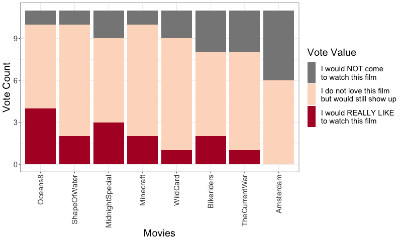

Movie Night Voting Tabulation
=============================

## Executive Summaries Go At the Top For Engagement

* The survey was completed 16 times. The tabulation committee appreciates your
contribution to avoiding the South Park movie
* **Pig** won with 10 votes in favour and 2 against
* Robin Hood: Men in Tights lagged Pig by a full 6 points, but holds a clear
second place
* There was a highly variable level of interest across this week's selection. 
Cruel Intentions was the movie with the fewest 'meh' votes (3), while Throw
Momma From the Train received the most (11).
* Not a single person was excited to watch Throw Momma From the Train.
* Of the 16*9 = 144 votes cast, 47 were negative, 37 were positive, and 60 were
neutral. 
* Row 1 (our surprise 9th option) placed dead centre with a score of -2. 2 
people wanted to watch Row 1, 4 did not, and 10 were indifferent.

## Setup

<details><summary>Click here for setup code</summary>

```{r, message = FALSE, warning = FALSE}
# setwd('~/Documents/PersonalProjects/MovieNight/')
setwd('~/Projects/Personal/MovieNight')
library(tidyverse)
library(lubridate)
devtools::load_all('~/Projects/Mine/aftersl1p/')
# devtools::load_all('~/Documents/PersonalProjects/aftersl1p/')
theme_set(theme_bw())

cols = c('#878787','#FDDBC7','#B2182B')
ranklevs = c('I would NOT come to watch this film',
		  'I do not love this film but would still show up',
		  'I would REALLY LIKE to watch this film')
make_rank = function(x){
	x = factor(x, levels = ranklevs)
	x = as.numeric(x) -2
	return(x)
}
```

</details>

## Import and Clean Data

The voting data are available as a .csv file [here](./data/current_week.csv).

<details><summary>Click here for data wrangling code</summary>

```{r}
dat = read.csv('data/current_week.csv', stringsAsFactors = FALSE, header = FALSE)
datm = as.matrix(dat)

tdf = read.csv('data/current_movies.csv', row.names = 1, header = FALSE, 
			   stringsAsFactors = FALSE)
titles = tdf[[1]]
titles
names(titles) = c(rownames(tdf))
titles

datm[datm %in% names(titles)] = titles[datm[datm %in% names(titles)]]
datm

# rev_titles = gsub(' [','',names(titles), fixed = TRUE)
# rev_titles = gsub(']','',rev_titles, fixed = TRUE)
# names(rev_titles) = titles
# colnames(datm) = rev_titles[colnames(datm)]
colnames(datm) = datm[1,]
datm = datm[-1,]

dat = (datm
	   %>% data.frame()
	   %>% mutate(Timestamp = substr(Timestamp, 1, 18),
	   		   Timestamp = ymd_hms(Timestamp)))
```

</details>


## Tabulate the results

```{r,  warning = FALSE, results = 'hold'}
dat_num = (dat
		   %>% select(-Timestamp)
		   %>% mutate_all(make_rank))
results = sort(colSums(dat_num), decreasing = TRUE)
res_df = data.frame(results)
# rownames(res_df) = rev_titles[rownames(res_df)]
res_df
```

#### Vampire Academy Wins!

**Pig** wins with 8 points!

## Pics or it didn't happen

<details><summary>Click here for plotting code</summary>

```{r, fig.width = 9, warning = FALSE, results = 'hold'}
brk_levs = c('I would NOT come\nto watch this film',
			 'I do not love this film\nbut would still show up',
			 'I would REALLY LIKE\nto watch this film')
dat_long = (dat
			%>% gather(Movies, Votes, -Timestamp)
			%>% mutate(Votes = factor(Votes, levels = ranklevs,
									  labels = brk_levs),
					   Movies = factor(Movies, levels = names(results))))
#levels(dat_long$Movies) = rev_titles[levels(dat_long$Movies)]
plt = ggplot(dat_long, aes(x = Movies, fill = Votes)) +
	geom_histogram(stat = 'count') +
	scale_fill_manual(values = cols, name = 'Vote Value') +
	ylab('Vote Count') +
	rotate_ticks() +
	theme(legend.text = element_text(margin = margin(t = 0.5,
													 b = 0.5,
													 unit = 'lines')))

png(filename = 'results/current_week.png', height = 480, width = 800)
plt +
	theme(axis.title = element_text(size = 20),
		  axis.text.y = element_text(size = 15),
		  axis.text.x = element_text(size = 15,
		  						  angle = 90,
		  						  hjust = 1,
		  						  vjust = 0.5),
		  legend.text = element_text(size = 15, margin = margin(t = 0.5,
		  													  b = 0.5,
		  													  unit = 'lines')),
		  legend.title = element_text(size = 20))
		  #legend.key = element_rect(colour = 'white', size = 10))
dev.off()
```
</details>




You can download a .png of the plot [here](./results/current_week.png).

